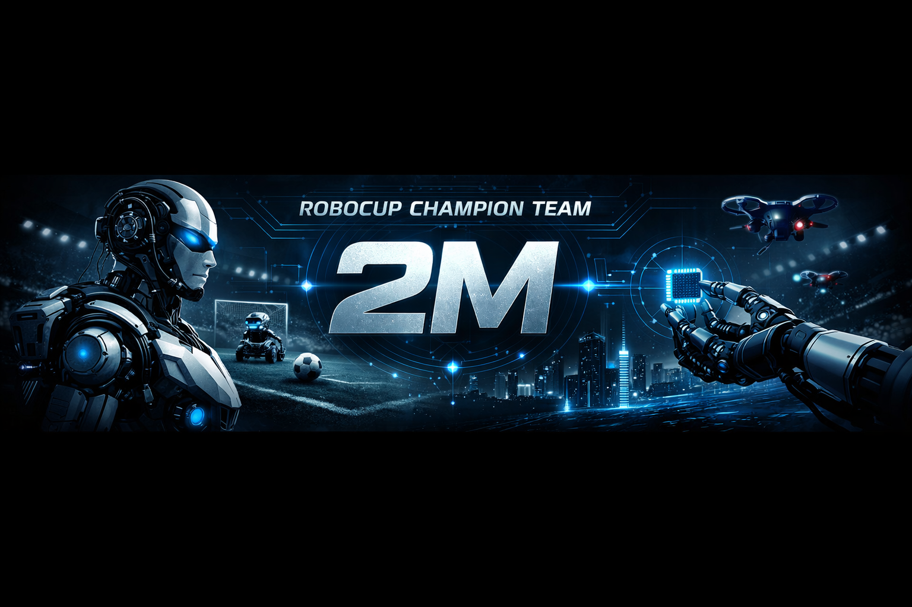

# 👋 Hi, I'm Mark

🏆 RoboCup participant & winner  
🤖 Robotics developer  
🚀 Building autonomous robots for competitions  

---

## ⚡ About Me
- 🤖 Robotics & Embedded Systems  
- 🧠 Computer Vision & AI  
- 🔧 Arduino • Raspberry Pi  
- 🏆 RoboCup competitor  

---

## 🚀 Tech Stack

---

## 📊 GitHub Analytics

---

## 🏆 Achievements

---

## 🧠 Activity Graph

---

## 🐍 Contribution Snake

---

## 🚀 Projects
- 🤖 Robot Vision System — object recognition  
- 🧭 Maze Solver Robot — maze navigation  
- 🏎 Line Follower Pro — advanced robot  

---

## 📫 Contact
- Telegram: @Team_2M  
- Email: mark.lisev1@mail.ru
